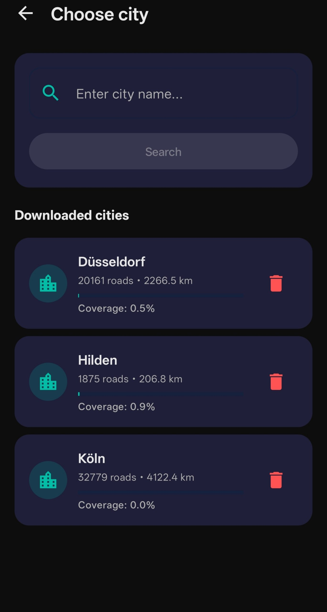
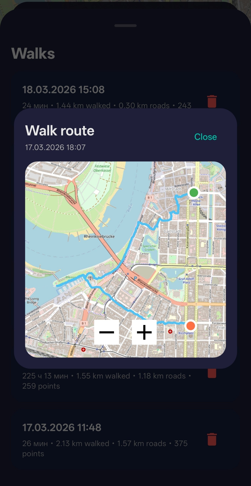
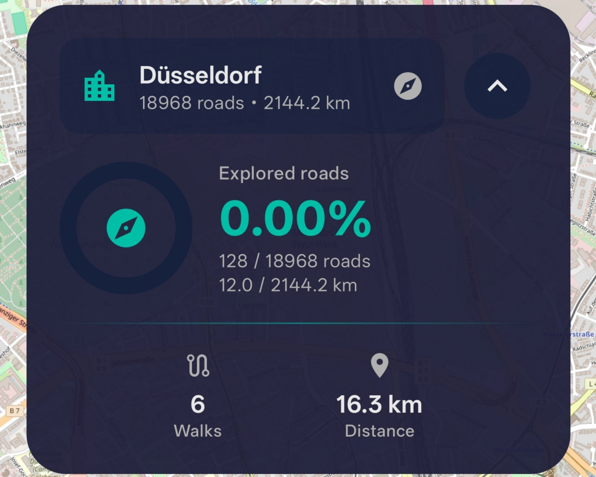
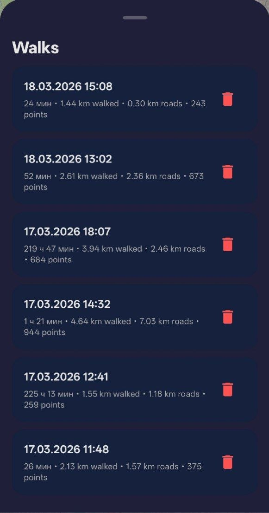

# SpyWalker

SpyWalker is an Android app for tracking walks and measuring how much of a city's street network you have explored. It combines live GPS tracking, OpenStreetMap data, and local storage to show your progress street by street.

The app lets you search for a city, download its road network, record walking sessions, and see how much of the city you have already covered. It also keeps a walk history, previews past routes, warns about weak GPS signal, and supports both English and Russian.

## Screenshots

### City selection and downloaded cities



### Live walk route on the map



### Coverage statistics widget



### Walk history and recorded sessions



## Features

- **City search and download** using OpenStreetMap Nominatim and Overpass APIs
- **Road coverage tracking** based on your recorded GPS path
- **Live map view** powered by OSMDroid / OpenStreetMap tiles
- **Walk session recording** with foreground location tracking
- **Coverage stats** for explored roads, total roads, and explored distance
- **Walk history** with per-session stats and route preview
- **Automatic city suggestion** when you move into a city that has not been downloaded yet
- **Weak GPS signal detection** to help explain inaccurate coverage
- **Language switcher** for English and Russian

## How it works

1. Search for a city and download its walkable/public road network from OpenStreetMap.
2. Select the city on the map.
3. Start a walk recording session.
4. As new GPS points arrive, the app matches them to nearby road segments.
5. Covered road chunks are stored locally and used to calculate exploration progress.
6. You can open the walk history later to review session stats and preview recorded routes.

## Tech stack

- **Kotlin**
- **Jetpack Compose** for UI
- **Room** for local persistence
- **Hilt** for dependency injection
- **OSMDroid** for map rendering
- **Google Play Services Location** for GPS tracking
- **Retrofit + Gson + OkHttp** for OpenStreetMap API communication

## Requirements

- Android Studio
- JDK 11
- Android SDK 34
- **Min SDK:** 26
- **Target SDK:** 34
- Java 11 / Kotlin JVM target 11

## Getting started

1. Clone the repository:

   ```bash
   git clone https://github.com/mvwj/spywalker.git
   ```

2. Open the project in **Android Studio**.
3. Let Gradle sync the project dependencies.
4. Run the app on a physical Android device or an emulator with location support.

## Build

From the project root:

```bash
./gradlew assembleDebug
```

On Windows:

```bash
gradlew.bat assembleDebug
```

## Permissions

SpyWalker requests these permissions to work correctly:

- **Fine / coarse location** — to detect your position and record walks
- **Background location** — to keep tracking while the app is not in the foreground
- **Foreground service** — to run active walk recording reliably
- **Notifications** — to show the ongoing tracking notification on newer Android versions
- **Internet / network state** — to load map data and query OpenStreetMap services

## Data sources

The app uses public OpenStreetMap services:

- **Nominatim** for city search and reverse geocoding
- **Overpass API** for downloading city road networks
- **OpenStreetMap tiles** for map display via OSMDroid

Please keep in mind that public OSM services may apply rate limits or temporary availability limits.

## Notes

- Downloaded city road data is stored locally in the app database.
- Map tiles are provided through OpenStreetMap/OSMDroid and may still require internet access unless already cached on the device.
- Coverage accuracy depends on GPS quality.
- The app includes logic to reduce false positives from weak or noisy GPS readings, but highly inaccurate signals can still affect results.

## Project structure

```text
app/src/main/java/.../
├── data/         # Room entities, DAOs, and OSM models
├── di/           # Dependency injection setup
├── repository/   # App repositories and business logic
├── service/      # Foreground GPS tracking service
└── ui/           # Compose screens and view models
```

## Future improvements

- Better offline map support
- More detailed analytics and exploration insights
- Export / import of walk history
- Improved road matching and route quality controls

---